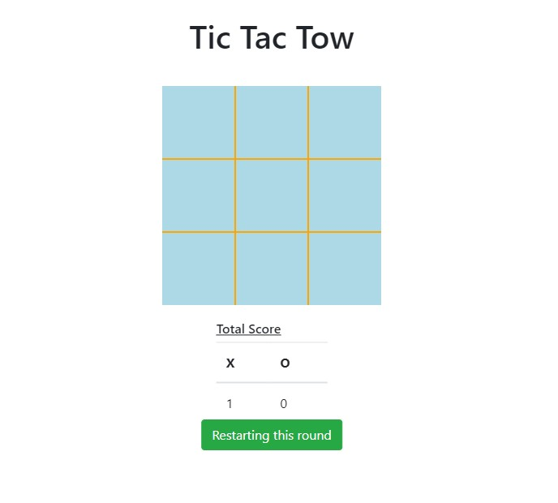

# Tick-Tack-Tow
A Tick Tack Tow Game combining JavaScript, Bootstrap & jQuery with design patterns resembling React or some other JS Framwork (with pushing most of HTML elements to DOM programatically), and Gaming Framworks with game-state object and event listemers (but without an unnecessary update loop).
You can play this game in: https://hkarmely.github.io/Tick-Tack-Tow/
 

</h1>

